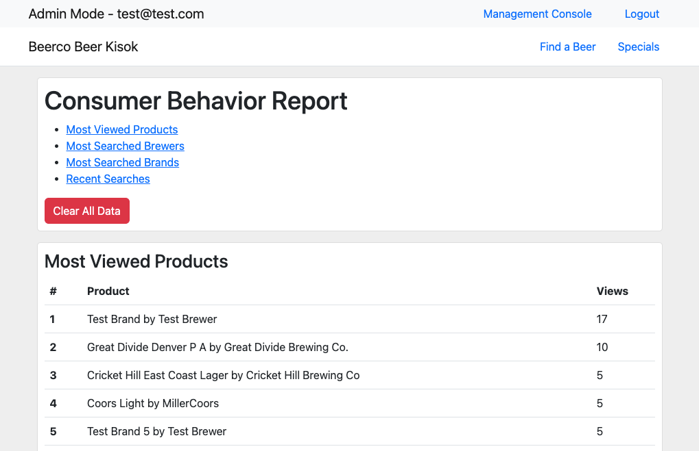

# Beerco Beer Kiosk

Beerco Beer Kisok is a web application written in PHP (Laravel) using a MySQL database. It was developed as a semester-length project for 50:198:423 (Software Engineering) at Rutgers—Camden in Fall 2022. The aim of the project was not simply to write some code, but to work with a team to turn a few business requirements into a deliverable piece of software. This process required drafting use cases and functional requirements, wireframing, development, QA, and delivery to the "client."

This particular project involved creating a web application to run on a fictitious beverage distribution company's (Beerco's) in-store kiosks that would allow consumers to search for beverages based on various qualities and attributes. For example, a customer could search for an India pale ale with an ABV of 6.5 from a North American brewer that pairs well with fish — and, given the product data provided to us for this project, would find 10 suitable beverages out of ~6700.

Another requirement was CRUD functionality: products should be able to be created, updated, viewed, and deleted. Of course, it's not acceptable for any old customer to be able to change prices or delete products, and so some authentication was necessary in order to only allow administrators to create, update, and delete products. Similarly, the average customer should presumably not be privy to the required consumer search behavior reports, and this information was tucked away neatly in the "admin management console" section of the application, visible only to those with administrative access.

Other requirements included a implementing a "similar products" feature and creating a "specials page" for the "retailer to identify brands with key price points". The provided business requirements can be viewed below.

### Business Requirements

|Number|Requirement|Priority|
|-|-|-|
BREQ-1|"Create a database that organizes beers by style, ABV, IBU, SRM, and food pairing (nice to have)" |High|
BREQ-2|"Develop database entry system to allow for ease of changing data (Beers): CRUD (Create, Remove, Update, Delete)"|Medium|
BREQ-3|Allow customer to search by: Style -> ABV -> IBU -> SRM; Country/region of origin; Specific brewer or brand; food pairings (nice to have)|High
BREQ-4|"Where desired beer is not in stock, offer 'like' beers to consumer"|Medium
BREQ-5|"Create 'Specials' page for retailer to identify brands with key price points"|Low
BREQ-6|"Technical requirement: Kiosk should download local copy of database daily and cache locally so that kiosk will work without an internet connection"|Medium
BREQ-7|"Administration interface should provide a simple report on the search behavior of customers including: search terms, most searched beers"|High
BREQ-8|"Kiosk will be a web based application on an in‐store PC with a large screen and branded enclosure"|High